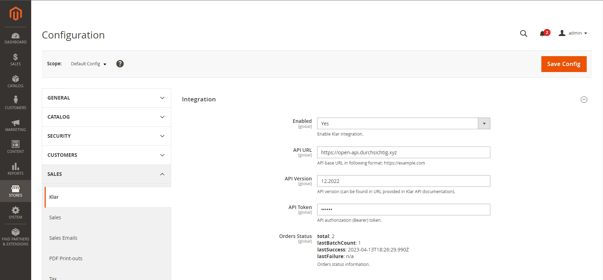

# Magento 2 Klar Integration Module

## Overview

The Magento 2 Klar integration module is a powerful tool designed to streamline the process of integrating the Klar
business intelligence platform into your Magento 2 store. With this module, you can easily connect your store to Klar
and centralize your data from a variety of sources, including your eCommerce platform, payment providers, and
advertising channels. Once your data is centralized, you can use Klar's powerful reporting and analytics tools to gain
deep insights into your store's performance, from customer behavior and sales trends to advertising ROI and much more.

## Compatibility

This module has been developed and tested on Magento 2.4.5-p1 using PHP 8.1. It may work with other versions of Magento 2
and PHP, but we cannot guarantee compatibility. If you encounter any issues with compatibility, please let us know by
creating an issue on GitHub.

## Installation

To install the module, follow these steps:

1. Put your Magento 2 store into maintenance mode by running the following command:

   ```
   bin/magento maintenance:enable
   ```

2. Add the GitHub repository as a new repository in your Magento 2 project's `composer.json` file:

   ```
   "repositories": [
     {
         "type": "vcs",
         "url": "https://github.com/ltd-iconcept/magento2-klar"
     }
   ]
   ```

3. Add the module to your project's `composer.json` file using the `require` command:

   ```
   composer require ltd-iconcept/magento2-klar:^1.0.0
   ```

   The `^1.0.0` indicates that you want to install version 1.0.0 or later.

4. Run the Composer install command:

   ```
   composer install
   ```

5. Enable the module by running the Magento CLI command:

   ```
   bin/magento module:enable ICT_Klar
   ```

6. Add following section into `env.php` file:
```
'cron_consumers_runner' => [
    'cron_run' => true,
    'consumers' => [
        'klar.order.synchronization'
    ]
]
```

7. Run the setup upgrade command to install the module and its dependencies:

   ```
   bin/magento setup:upgrade
   ```

8. Compile your Magento dependency injection configuration:

   ```
   bin/magento setup:di:compile
   ```

9. Deploy your static view files:

   ```
   bin/magento setup:static-content:deploy
   ```

10. Clear the Magento cache:

```
bin/magento cache:clean
```

11. Take your Magento 2 store out of maintenance mode by running the following command:

```
bin/magento maintenance:disable
```

12. Make sure that cron configured properly (ref. [Magento 2 DevDocs](https://devdocs.magento.com/guides/v2.3/config-guide/cli/config-cli-subcommands-cron.html))

13. Configure the module as needed.

### Installing updates

1. Update the module using the `update` command:

   ```
   composer update ltd-iconcept/magento2-klar
   ```

2. Put your Magento 2 store into maintenance mode by running the following command:

   ```
   bin/magento maintenance:enable
   ```

3. Proceed with installation steps 6. - 13.

## Configuration

To enable Magento 2 Klar integration in the Magento admin panel, follow these steps:

1. Log in to the Magento admin panel.
2. Navigate to Stores > Configuration > Sales > Klar.
3. Set the "Enabled" flag to "Yes".
4. Fill in the "API URL", "API Version", and "API Token" fields with the appropriate values. These values will be
   provided to you by Klar.
5. Save the configuration and clear Magento cache.

### Configuration example:



## Usage

Once the module is installed and configured, you can use it to centralize your store's data and gain insights into its
performance using Klar's powerful reporting and analytics tools. There are no extra actions needed, integration is
working automatically.

## Support

If you encounter any issues with the Magento 2 Klar integration module, please report them in the GitHub repository or
contact the module developer for support.

## License

The Magento 2 Klar integration module is licensed under the GNU General Public License v3.0.
